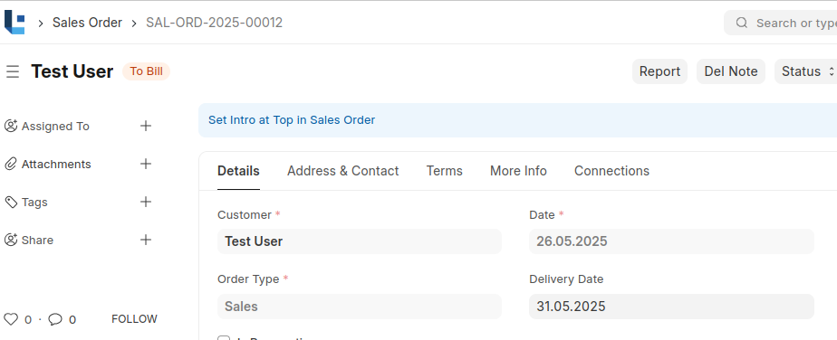
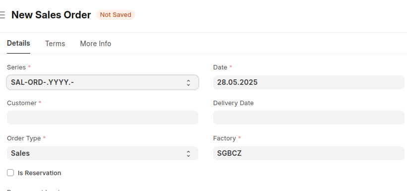

# Client Side

# Using ''frappe.call'' with Various Built-in Methods 

## Using `frappe.call` in Frappe Javascript
* Used to call backend (Python) methods from frontend (JavaScript)
* Commonly used for accessing and updating data from the doctypes.

**Command Syntax**

```javascript
frappe.call({
    method: "<method_path>",
    args: {
        <arg_key>: <arg_value> 
    },
    callback: function(ldResponse) {
        console.log(ldResponse.message);
    }
})
```

### Using the frappe.client.get method with `frappe.call` – Fetch Full Document

* Used to get a complete document using its name. 
* Helpful when you need all fields including child tables


**Command Syntax**

```js
frappe.call({
    method: "frappe.client.get",
    args: {
        doctype: "<doctype_name>",
        name: "<doctype_id>"
    },
    callback: function(r) {
        console.log(r.message);
    }
});
```

**Parameters & Options**
| Parameter | Type    | Description         |
| --------- | ------- | ------------------- |
| `doctype`  |  string  |  Doctype Name ("Sales Order")       |
| `name`  |  string  |  Document ID ("SAL-ORD-2025-00015")       |

**Common Patterns or Use Cases**

```js
frappe.call({
    method: "frappe.client.get",
    args: {
        doctype: "Sales Order",
        name: "SAL-ORD-2025-00015"
    },
    callback: function(ldResponse) {
        if(ldResponse.message) {
            const ldDoc = ldResponse.message;
            console.log("Customer:", ldDococ.customer);
            console.log("Status:", ldDoc.status);
            console.log("Items:", ldDoc.items);
        } 
    }
});

```
**Sample Output :**
```
{
    "name": "SAL-ORD-2025-00015",
    "customer": "ABB AG",
    "status": "To Deliver",
    "items": [
        {
            "item_code": "DTTHZ2N 1200/10/400/6/75",
            "qty": 1,
            "rate": 10000
        }
    ]
}
```


---

### Using the frappe.client.get_value method with `frappe.call` – Fetch Specific field

* Used to retrieve only selected fields 
* Lightweight and faster for quick lookups


**Command Syntax**

```js
frappe.call({
    method: "frappe.client.get_value",
    args: {
        doctype: "<doctype_name>",
        filters: { name: "<doctype_id>" },
        fieldname: ["<field_1>", "<field_2>"]
    },
    callback: function(ldResponse) {
        console.log(ldResponse.message);
    }
});
```

**Parameters & Options**
| Parameter | Type    | Description         |
| --------- | ------- | ------------------- |
| `doctype`  |  string  |  Doctype Name ("Sales Order")       |
| `filters`  |  object  |  Field-value pairs       |
| `fields`  |  string/array  |  One or More fields     |

**Common Patterns or Use Cases**

Fetching only specific fields (e.g. customer, transaction_date)

```js
frappe.call({
    method: "frappe.client.get_value",
    args: {
        doctype: "Sales Order",
        filters: { name: "SAL-ORD-2025-00015" } 
        fieldname: ["customer", "transaction_date"]
    },
    callback: function(ldResponse) {
        if(ldResponse.message) {
            const ldDoc = ldResponse.message;
            console.log("Customer:", ldDococ.customer);
            console.log("Transaction Date:", ldDoc.transaction_date);
        } 
    }
});

```
**Sample Output :**
```
{
    "customer": "ABB AG",
    "transaction_date": "2025-05-28"
}
```

### Using the frappe.db.get_value method – Fetch Specific Field(s) without fetching full document

* Used to retrieve only selected fields from a document.
* Lightweight and faster for quick lookups


**Command Syntax**

```js
frappe.db.get_value(doctype, filters, fieldname, callback);
```

**Parameters & Options**
| Parameter | Type    | Description         |
| --------- | ------- | ------------------- |
| `doctype`  |  string  |  Doctype Name ("Sales Order")       |
| `filters`  |  object  |  Field-value pairs       |
| `fields`  |  string/array  |  One or More fields     |
| `callback`  |  function  |  process the response     |

**Common Patterns or Use Cases**

Fetching only specific fields (e.g. customer, transaction_date)

```js
frappe.db.get_value(
    "Sales Order",
    { name: "SAL-ORD-2025-00015" },
    ["customer", "transaction_date"],
    function(ldResponse) {
        if (ldResponse.message) {
            const ldDoc = ldResponse.message;
            console.log("Customer:", ldDoc.customer);
            console.log("Transaction Date:", ldDoc.transaction_date);
        } 
    }
);

```
**Sample Output :**
```
{
    "customer": "ABB AG",
    "transaction_date": "2025-05-28"
}
```


### Using frappe.set_intro – Display an Introductory Message in a Form
* Shows a small descriptive message at the top of the form.
* Helps provide guidance or context to users filling the form.


**Command Syntax**

```js
frappe.set_intro(message);
```

*Parameters & Options*
| Parameter | Type    | Description            |
| --------- | ------- | ---------------------- |
| message  |  string  |  Displaying text       |


*Common Patterns or Use Cases*

```js
frappe.ui.form.on('Sales Order', {
    onload: function(frm) {
        frm.set_intro("Set Intro at Top in Sales Order");
    }
});
```

*Sample Output :*



### Using frappe.df.set_property – Set Properties Dynamically on DocField in a Form
* Modify field properties such as reqd (mandatory), read_only, hidden, etc., dynamically.


**Command Syntax**

```js
frappe.df.set_property(fieldname, property, value, frm);
```

*Parameters & Options*
| Parameter | Type    | Description         |
| --------- | ------- | ------------------- |
| fieldname  |  string  |  Fieldname      |
| property  |  string  |  Property to set (e.g., "reqd", "hidden")     |
| value  |  boolean  |  0 or 1    |
| frm  |  object  |  Form object (usually passed as frm)    |


*Common Patterns or Use Cases*

```js
frappe.ui.form.on('Sales Order', {
    onload: function(frm) {
        if (frm.doc.custom_factory === 'SGBCZ') {
            frm.set_df_property('custom_factory', 'reqd', 1);
        } else {
            frm.set_df_property('custom_factory', 'reqd', 0);
        }
    }
});
```

*Sample Output :*



## JavaScript Array Methods

### 1. forEach() – Loop through Sales Order Items
**Description**: Iterates over each item in the items array and performs an operation (e.g. log details or compute amount).

**Common Syntax**
```
laArray.forEach(function(ldItem, lIndex) {
		//code here
});
```

**Parameters & Options:**
| Parameter | Type    | Description            |
| --------- | ------- | ---------------------- |
| ldItem  |  object  |  current item from the array       |
| lIndex  |  number  |  Index of the current item       |


**Use Cases**

A company sells equipment, and each item in a Sales Order Item has its qty. We want to calculate the total qty of all items and show it in a custom field total_qty on the Sales Order form.

We will use forEach() to iterate over the items table and add up the individual warranty months.

```
let lTotalQty = 0;

frm.doc.items.forEach(ldItem => {
    if (ldItem.qty) {
        lTotalQty += ldItem.qty;
    }
});

// Set the total in a custom field on the main form
frm.set_value('total_qty', lTotalQty);
```

### 2. map() – Transform Sales Order Items

**Description**: Returns a new array by transforming each item in the list (e.g. extract item codes).

**Common Syntax**
```
const laResult = laArray.map(function(ldItem) {
    return transformedValue;
});
```
**Parameters & Options:**
| Parameter | Type    | Description            |
| --------- | ------- | ---------------------- |
| ldItem  |  object  |  current item from the array       |

**Use Cases**

You want to list all item_codes from the sales order to display in a summary section.

```
const LAitemCodes = salesOrder.items.map(function(ldItem) {
    return ldItem.item_code;
});
console.log("Item Codes:", LAitemCodes);
```
**Sample Output**
```
Item Codes: ["DTTHZ2N 1200/10/400/6/75", "DTTHZ2N 800/10/400/6/50"]
```

### 3.find() – Find First Matching Item

**Description**: Returns the first item that matches a condition (e.g. first bulk item).

**Common Syntax:**
```
const LAresult = laArray.find(function(ldItem) {
    return condition;
});
```
**Parameters & Options:**
| Parameter | Type    | Description            |
| --------- | ------- | ---------------------- |
| ldItem  |  object  |  current item from the array       |

**Use Cases**

The sales manager wants to be alerted if any item in the Sales Order has a quantity greater than 10, which might need special approval or handling.

We’ll use find() to quickly detect the first such item.

```
let ldHighQtyItem = frm.doc.items.find(item => item.qty > 10);

if (ldHighQtyItem) {
    console.log("First Item with Quantity > 10:", ldHighQtyItem.item_code);
}
```
**Sample Output:**

First Item with Quantity > 10: DTTHZ2N 800/10/400/6/50

### 4. filter() – Filter Matching Items

**Description:** Returns a new array with all items that match the condition (e.g. expensive items).

**Common Syntax:**
```
const LDresult = laArray.filter(function(ldItem) {
    return condition;
});
```
**Parameters & Options:**
| Parameter | Type    | Description            |
| --------- | ------- | ---------------------- |
| ldItem  |  object  |  current item from the array       |

**Use Cases**

You want to extract all items that belong to the item group "Transformers" to apply some logic — for example warranty rules.

```
let laTransformerItems = frm.doc.items.filter(item => item.item_group === 'Transformers');

// You can now use laTransformerItems for further logic
console.log("Transformer Items:", laTransformerItems);

laTransformerItems.forEach(ldItem => {
    ldItem.warranty_months = 24;  // Set a default warranty
});
```


### 5. reduce() – Calculate Total Value

**Description:** Reduces the array to a single value (e.g. total sales order amount).

**Common Syntax:**
```
const LDresult = laArray.reduce(function(lAccumulator, ldItem) {
    return updatedAccumulator;
}, lInitialValue);
```
**Parameters & Options:**
| Parameter | Type    | Description            |
| --------- | ------- | ---------------------- |
| lAccumulator  |  number  |  total/result       |
| ldItem  |  object  |  Current item in the array       |
| lInitialValue  |  number  |  Starting value (e.g. 0)       |

**Use Cases**

You want to calculate the total value of a Sales Order for quote submission.

```
//Calculate total amount of sales order
const LtotalAmount = salesOrder.items.reduce(function(lAcc, ldItem) {
    return lAcc + ldItem.qty * ldItem.rate;
}, 0);

console.log("Total Sales Order Amount:", LtotalAmount);
```

**Sample Output:**
```
Total Sales Order Amount: 27000
```

## JavaScript Child Table

### Accessing All Rows in a Child Table
**Description:** Access all rows (documents) inside the items child table.

**Common Syntax** 
```
const laChildRows = frm.doc.items;
laChildRows.forEach(function(ldRow, lIndex) {
    // perform operations
});
```
**Parameters & Options:**
| Parameter | Type    | Description            |
| --------- | ------- | ---------------------- |
| laChildRows  |  array  |  Array of child table rows      |
| ldRow  |  object  |  Current row in the child table       |
| lIndex  |  number  |  Index of the current row      |

**Common Patterns or Use Cases**
```
frm.doc.items.forEach(function(ldRow, lIndex) {
    console.log(`Item ${lIndex + 1}:`, ldRow.item_code);
});
```

**Sample Output:**

Item 1: DTTHZ2N 1200/10/400/6/75
Item 2: DTTHZ2N 800/10/400/6/50

### Adding a New Row to Child Table

**Description:** Programmatically adds a new row to the items table.

**Common Syntax:**

```javascript
let lNewRow = frm.add_child("items");
lNewRow.item_code = "DTTHZ2N 2000/12/440/6/75";
frm.refresh_field("items");
```

| Parameter | Type    | Description            |
| --------- | ------- | ---------------------- |
| frm  |  object  |  Current form instance      |
| lNewRow  |  object  |  Newly added child table row |
  

**Common Patterns or Use Cases**
```
const lNewRow = frm.add_child("items");
lNewRow.item_code = "DTTHZ2N 2000/12/440/6/75";
lNewRow.qty = 2;
lNewRow.rate = 150;
frm.refresh_field("items");
```

**Sample Output:**
A new row appears in the child table with DTTHZ2N 2000/12/440/6/75.

### Accessing Specific Row by cdt and cdn
**Description:** Get a specific child table row being modified (e.g. in on_change).

**Common Syntax**
```
let lRow = locals[cdt][cdn];
console.log(lRow.item_code);
```
| Parameter | Type    | Description            |
| --------- | ------- | ---------------------- |
| cdt  |  string  |  Child Doctype      |
| cdn  |  string  |  Unique row identifier |
| locals  |  object  |  Local model holding all doc data |

**Common Patterns or Use Cases**
```
items_add(frm, cdt, cdn) {
    let lRow = locals[cdt][cdn];
    lRow.qty = 1;
    frm.refresh_field("items");
}
```

**Sample Output:**
```
Row is updated to quantity 1.
```

### Modifying Child Table Field Properties
**Description:**  Dynamically change a child table column’s properties like reqd, hidden, or read_only.

**Common Syntax**
```
frm.fields_dict["items"].grid.update_docfield_property("item_code", "read_only", 1);
frm.fields_dict["items"].grid.refresh();
```

| Parameter | Type    | Description            |
| --------- | ------- | ---------------------- |
| item_code  |  string  |  Fieldname in the child table    |
| read_only  |  string  |  Property to update |
| 1 / 0  |  boolean  |  Value of the updated property |

**Common Patterns or Use Cases**
```
frm.fields_dict["items"].grid.update_docfield_property("rate", "reqd", 1);
frm.fields_dict["items"].grid.refresh();
```

**Sample Output:**
```
The rate column in child table becomes mandatory.
```

### Clear or Set Options in a Field in Child Table
**Description:** Clear or dynamically change dropdown options for a child table field.

**Common Syntax**
```
frappe.meta.get_docfield("Sales Order Item", "item_group", frm.docname).options = "";
```
| Parameter | Type    | Description            |
| --------- | ------- | ---------------------- |
| Sales Order Item  |  string  |  Child doctype name    |
| item_group  |  string  |  Field in the child table |
| frm.docname  |  string  |  Name of the parent document |

**Common Patterns or Use Cases**
```
frappe.meta.get_docfield("Sales Order Item", "item_group", frm.docname).options = "DTTH2n\nDOTML";
frm.fields_dict["items"].grid.refresh();
```

**Sample Output:**
```
Dropdown list for item_group is updated.
```


## Get value of password field
When used get_value() for password field, the return value is asterisk(encrypted), so use `get_password` method to retrieve the actual value of password type field

**Basic Syntax**
in client
```
frappe.call({
	"method": "frappe.client.get_password",
	"args":{
	"doctype": <doctype_name>
	"name": <document_name>
	"fieldName": <field_name>
	}
})
```
**Common Use Cases** 

 - getting the open api key from raven settings doctype
 ```
 frappe.call({
	 "method": "frappe.client.get_password",
	 "args":{
		 "doctype": "Raven Settings,
		 "name": "Raven Settings", //single doctype
		 "fieldName": "openai_api_key"
	}
	"callback": function(idResponse){
		if(idResponse.message){
			console.log("open api key", idResponse.message)
		}
	}
})
 ```
**Sample Output**
```
open api key fhryryfhghgus8ghffgfhffjfjgjreg
```


# Server Side

## frappe.get_doc in server side
Returns a document object for the given doctype and name, if no document match throw "DoesNotExistError".
Note: for single doctype, name is not required

**Basic Syntax**
```
frappe.get_doc(<doctype_name>, <document_name>)
```
**Common Use Case**
```
ld_task = frappe.get_doc("Task", "TASK-0023")
frappe.msgprint(str(ld_task.title)) //ex: title is Cpq Documentation
```
**Sample Output**
```
Cpq Documentation
```
For single doctype
```
ld_system_setting = frappe.get_doc("System Setting")
frappe.msgprint(str(ld_system_setting.theme)) //ex: theme is dark
```
**Sample Output**
```
dark
```

## Doctype's MetaData

use `get_meta` to get specific Doctype's information along with the custom field and property setter

**Basic Syntax**
This method can only be used on Server Side
```python
frappe.get_meta('<doctype_name>')
```

**Common Use Cases**
```python
ld_ToDo_meta = frappe.get_meta("ToDo")
frappe.msgprint(str(ld_ToDo_meta.fields)) #printing the meta information of the fields

#Note: str() should be used to flaten the object, otherwise it will be printed as [Object][Object]
```
**Sample Output**
```
{
  "message": [
    {
      "name": "jv5ncgrirp",
      "docstatus": 0,
      "parent": "ToDo",
      "parentfield": "fields",
      "parenttype": "DocType",
      "idx": 1,
      "fieldname": "description_and_status",
      "fieldtype": "Section Break",
      "hidden": 0,
      .......},
      {
      "name": "jv511449u4",
      "docstatus": 0,
      "parent": "ToDo",
      "parentfield": "fields",
      "parenttype": "DocType",
      "idx": 2,
      "fieldname": "status",
      "label": "Status",
      "fieldtype": "Select",
      "options": "Open\nClosed\nCancelled",
      ....},
      ....
      ]}
```


# CPQ CheatSheet
## Setting a watch flag for a field
In client script you use `fieldName(frm)` to implement onChange of specific field. similarly, you can achieve the same in vue js using `watch()`
Note: only use it on core, not on CRM Form Script

**Basic Syntax**
```
watch(fieldName, (NewValue, OldValue) =>{
//your logic
}
{ immediate: false } //to avoid initial undefined error onmount
)
```
**Common Use Cases** 

 - On Change of tabs from Activity to Note, 
 ```javascript
 watch(tabs, (CurrentTab, PreviousTab) => {
	 //using watch we can access previous and current value of the field
	 console.log("previous selected tab", PreviousTab)
	 console.log("current selected tab", CurrentTab)
	}
	{immediate: false}
)
 ```
**Sample Output**
```
previous selected tab Activity
current selected tab Note
```
## Custom Button in CPQ
use CRM Form Script (client script for CPQ) to add custom button in the both ListView or Individual View

**Pre-requisite**
Go to CRM Form Script, create a new CRM Form Script with Name "Custom Button", Doctype: "CRM Deal", Apply To: "Form" and enable the script

**Basic Syntax**
```
action:[{"label": <label>, "onClick": () => {//your logic}
}]
```
**Common Use Cases** 

 - Create a View Quotation button on Deal 
 ```
 function setupForm({ doc }) {
    return {
 action:[{"label": "View Quotation", "onClick": () => {console.log("The button "View Quotation" is clicked")}
 }]
 }
 }
 ```
**Sample Output**
 - Open the Existing Deal Document, you will see the "View Quotation" button at top right corner
 - On clicking the "View Quotation" button
 ```
 //in browser console
 The button "View Quotation" is clicked
 ```

## Navigating pages using router
To navigate between pages like from **Deal** to **Quotation** in **CPQ** using a **Frappe form script**, you can use `router()` which is similar to set_route() in frappe

**Pre-requisite**
Include the `router` param in the `setupForm` function

**Basic Syntax**
```
router.push({"name": <doctype_name>, "params": {"name": <id>}
})
```
**Common Use Cases** 

 - navigate to the quotation created for the Specific Deal (ex: CRM-DEAL-0003) 
 ```
  function setupForm({ doc, router }) {
    return {
 action[{
 "label": "View Quotation",
 "onClick": () => {
	 router.push({"name": "Quotation", "params": {"name": doc.custom_quotation_id}
     })
	}
}] 
}
}
 ```
**Sample Output**
On clicking the View Quotation button in the CRM-DEAL-0003 will take you to the Quotation

## ref  in Vue js
Use `ref()` to create a value, where Vue wraps it in a reactive object so it can track changes and trigger updates in the UI when used in templates.

**Pre-requisite**
```javascript
import { ref } from 'vue'
```
**Basic Syntax**
```javascript
ref(<intial_value>)
//`intial_value` can be any type: number, string, boolean, array, object, etc.
```
**Common Use Cases **
```javascript
<template>
<Button 
	:label="__('Create')"
	:loading="IsLoading" //When you use a `ref` variable in the template, Vue automatically unwraps `.value`, so you can use it directly.
	@click="fnHandleClick" />
</template>
<script setup>
const IsLoading = ref(false)
function fnHandleClick(){
	IsLoading.value = true  //To access or update it: use `.value`
	.....
	//after successfull created
	IsLoading.value = false 
}
</script>
```
**Sample Output**
When you clicked the "Create" button an spinner animation appear, after successfully creation, the button come back to normal

## reactive in Vue.js

 - `reactive()` makes an object "watchable" so Vue knows when its data
   changes.
 - the difference between ref() and reactive() is that reactive only work with object or array, so you can't use it for single primitive like reactive(5) or reactive(false)

**Pre-requisite**
```javascript
import { reactive } from 'vue'
```
 **Basic Syntax**
```javascript
reactive({
	"name":"",
	"items":[]
	})
```
**Common Use Cases **
```javascript
<template>
<FormControl 
	:label="__('Design Template')"
	type="text"
	:placeholder="design_template"
	@change="(value)=> fnHandleUpdate("design_template", value)"
	/>
</template>
<script setup>
const Design = reactive({"design_template":"", "direct_material": ""})
function fnHandleUpdate(iField, iValue){
	Design[iField] = iValue
	console.log(`${iField} is set to ${iValue}`)
}
</script>
```
**Sample Output**
```
Design Template is set to Step Up
```

##  Frappe Resource API
`createResource()` from frappe-ui is an build in reactive object that is used for `async` data fetching and processing with build in loading state, cache, error handling and watcher
**Pre-requisite**
```javascript
import { createResource } from 'frappe-ui'
```
 **Basic Syntax**
```javascript
createResource({
	url: <method_path>,
	params: {<filters, fields>},
	cache: ['<cache_name>', <variable_of_createResouce>],
	auto: true,
	onSuccess(data){}, //on successful response
	transform(data){}, //transform data before setting it
	onError(error){}, //error can occur from failed request and validate function
	makeParams(){}, //generate params from function
	validate(params){}, //validate parameters before making request
})
```
**Common Use Cases **
```
const LaFieldLayout = createResource({
	url: "crm.fcrm.doctype.crm_fields_layout.crm_fields_layout.get_fields_layout",
	params:{ doctype: "Item", type: "Quick Entry"},
	cache: ["tabs", LaFieldLayout],
	auto: true,
	onSuccess(iaTabs){
		//the return structure of this endpoint will be like
		//[{secions:[columns:[fields:[fieldName: "", fieldType: ""]]]}, {}]
		iaTabs.forEach((idTab) => {
			idTab.sections.forEach((idSection) => {
				idSection.columns.forEach((idColumn) => {
					idColumn.fields.forEach((idField) => {
						if(idField.fieldType == "Table"){
							console.log("Field name", idField.fieldName)
						}
					})
				})
			})
		})
	}
})
```
**Sample Output**
```
Field name Item Attribute
```
## Classes and Objects

## Constructor
A **constructor** is a special method in a class that gets called automatically when a new instance of the class is created. It is used to **initialize the object** with values or set up initial logic.**Basic Syntax:**
```ts
class ClassName {
    constructor(parameter1: Type, parameter2: Type) {
        // Initialization code here
    }
}
```
You can access the constructor via the `new` keyword:
```
const obj = new  ClassName(value1, value2);
```
**Use Case**
We use constructors in **base and derived classes** to **pass and initialize shared data** like `action` and `actionData`.```ts
class clActionOnLoad extends clAction {
    constructor(iAction: string, iaActionData: TTactionsData) {
        super(iAction, iaActionData); // Calls the constructor of the base class
    }
    // overrides and method calls
}
```
**WHY**
-   You pass data like `action` and `actionData` to the base class once.
-   You avoid repeating initialization logic in every subclass.
-   Subclasses can still add their own logic **after calling `super()`**.

## Interface
An **interface**  is a syntactic contract that defines the **structure of an object or class**. It ensures that a class or object adheres to a particular shape by specifying what properties and methods it must have.**Basic Syntax:**
```javascript
interface InterfaceName {
    propertyName: type;
    methodName(): returnType;
}
```
**Use Case:**
We use the **interface** in the `types.ts` file to **define the structure** that any class or object must follow. In this case, the `ifActionHandler` interface acts as a **contract** for all action handlers, ensuring they have the necessary properties and methods.
```javascript
interface ifActionHandler {
    action: string;
    actionData: TTactionsData;
    actionRow: TactionData;
    executeAction(): void;
    checkFieldValue(): void;
    checkFieldProperties(): void;
    dataType: ifDataType;
}
```
Use this interface in an **abstract class**:
```
abstract class clAction implements ifActionHandler {
    // Must implement all properties and methods from the interface
}
```**WHY:**
-   By using the interface in the `types.ts`, you define a **standard structure** for all actions.
-   Every class that implements this interface will be forced to follow that structure.
-   This helps in maintaining **consistency**, improving **type safety**, and enabling **scalable code architecture**.

## Factory class
	
Use a factory class when you need to **dynamically create instances** of different classes based on a runtime condition (e.g., a string key), **without hardcoding class instantiations**.**Use Case:**
Dynamically create and return the correct `clAction` subclass based on the action type string at runtime (e.g., `"Onload"`, `"Add Row"`, etc.).
```javascript
// Factory class to create action instances dynamically based on action type
class clActionFactory {
  private static actionsMap: {
    [key: string]: new (iAction: string, iaActionData: TTactionsData) => clAction
  } = {
    "Onload": clActionOnLoad,
    "On Change": clActionOnChange,
    "On Tab": clActionOnTab,
    "Add Row": clActionAddRow,
    "Edit Details": clActionEditDetails,
    "Expand Section": clActionExpandSection,
  };
  // Factory method to return the correct action class instance at runtime
  static createAction(
    type: string,                         // Action type string (e.g., "Add Row")
    iAction: string,
    iaActionData: TTactionsData
  ): clAction {
    const ActionClass = this.actionsMap[type];
    if (!ActionClass) {
      throw new Error(`Action type '${type}' is not registered.`);
    }
    // Return a new instance of the action class
    return new ActionClass(iAction, iaActionData);
  }
}
```
-   Easily create instances of different classes based on a string key without hardcoding logic.
-   Easily register new actions by adding to `actionsMap`
-   Keeps instantiation logic centralized.